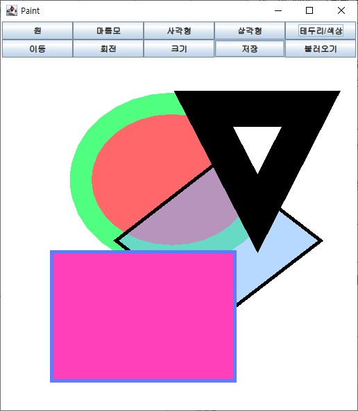
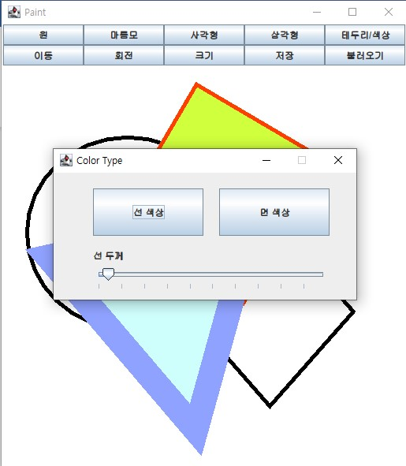

# MVC Paint Program with JAVA Swing

### 2020-1학기 소프트웨어프로젝트 기말과제

</img>
</img>

2020-1학기 소프트웨어프로젝트 과목의 기말고사 대체과제로 개발한
그림판 프로그램입니다.

Java Swing 라이브러리를 이용해 GUI를 구현하였고,
MVC 구조로 Model, View, Controller를 분리하여 
객체지향 프로그램의 특성을 살릴 수 있도록 개발하였습니다.

***

### 배포 내역
* 2020\. 05\. 개발 시작
* 2020\. 06\. 개발 완료